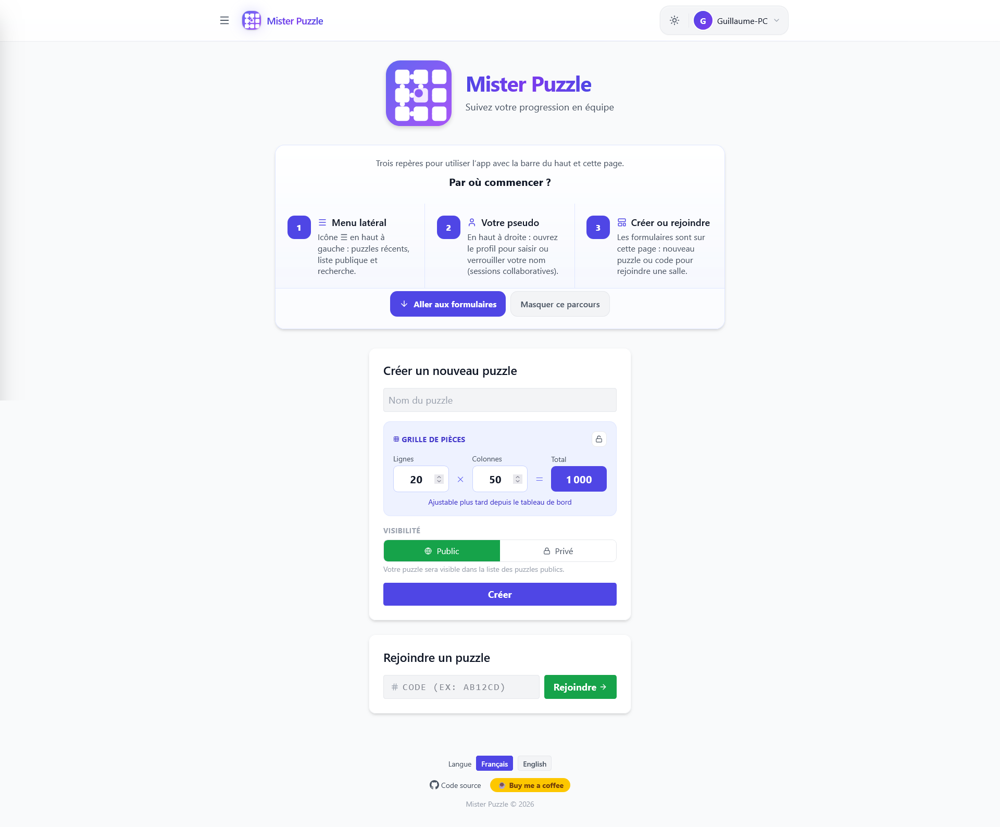
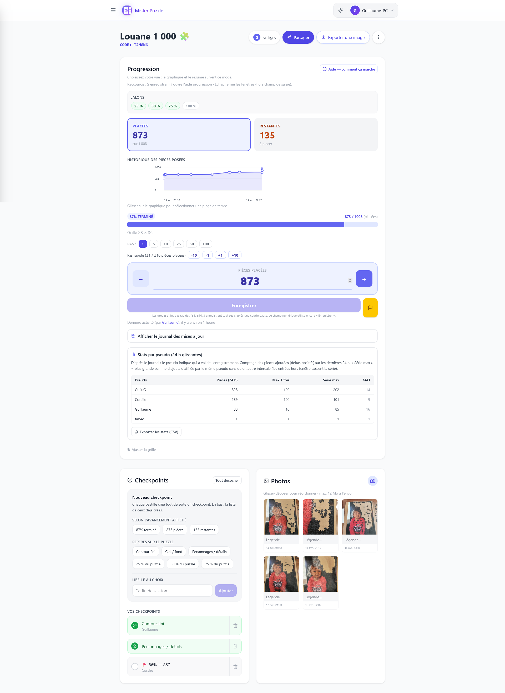

# Mister Puzzle


**Votre progression de puzzle, ensemble, en temps réel**

Un site web pour suivre ensemble l'avancement d'un puzzle : pièces placées, historique graphique, photos, checkpoints et partage par code.

Disponible sur **PC, tablette et mobile** — pas d'inscription, pas de compte, juste un code à partager.

## Aperçu de l'application

<table>
<tr>
<td width="50%"></td>
<td width="50%"></td>
</tr>
<tr>
<td align="center">Accueil</td>
<td align="center">Suivi de progression</td>
</tr>
</table>

---

## Pourquoi utiliser Mister Puzzle ?

Suivre un puzzle à plusieurs, c'est le chaos. Qui a mis quoi ? Où en est-on ? Qui a travaillé dessus hier ?

Mister Puzzle résoud ce problème avec une synchronisation **temps réel ou asynchrone** et un historique visuel clair.

## L'histoire d'origine

**Le problème** : Un puzzle géant pendant les vacances de famille. Tout le monde participe à son rythme :
- Les lève-tôt posent quelques pièces avant le petit-déjeuner
- Les nocturnes continuent après le dîner
- Les enfants entre deux temps calmes

Mais les membres de la famille qui ne sont PAS là sont frustrés :
- "Alors, on en est où là ?"
- "Envoyez-nous une photo du puzzle !"
- "Vous avez beaucoup avancé cette semaine ?"

**La solution Mister Puzzle** :
- Chacun met à jour le compteur après sa session
- **Progression partagée** automatiquement avec toute la famille
- **Historique visuel** : voir l'évolution sans redemander
- **Partage externe** : les absents suivent en temps réel comme un spectacle

**Le petit plus fun ? Les stats !** Qui a posé le plus de pièces sur les dernières 24 heures, les 7 derniers jours ou depuis le début ? Qui tient la plus longue série ? La courbe, elle, montre le rythme. Pour le défi et les conversations de famille.

## Exemples concrets d'utilisation

### Puzzle en médiathèque ou lieu public
Un puzzle est installé dans une médiathèque. Chaque visiteur peut contribuer à son rythme :
- Le matin, Madame X pose 50 pièces
- L'après-midi, un groupe d'ados continue
- Le soir, le bibliothécaire fait un point
- **Tout le monde suit la progression** sans jamais se rencontrer !

### Bureau / Coworking
Un puzzle dans une salle de repos :
- Matin : l'équipe marketing pose quelques pièces
- Midi : les développeurs continuent
- Soir : l'équipe RH termine une zone
- **Esprit d'équipe** sans contrainte d'horaire

### École / Bibliothèque scolaire
Un projet pédagogique sur plusieurs semaines :
- Les élèves de la classe A travaillent le lundi
- La classe B reprend le mercredi
- Suivi par l'enseignant entre les sessions
- **Projet collaboratif inter-classes**

### Événement public (salon, fête)
Un puzzle géant pendant un événement :
- Les participants viennent et repartent
- Chacun contribue ce qu'il veut
- Le public voit l'avancement en temps réel
- **Animation collective** sans coordination

### Cas solo mais multi-appareils
Un seul puzzleur qui utilise plusieurs appareils :
- Met à jour depuis son téléphone sur le canapé
- Continue sur son ordinateur
- Vérifie sur sa tablette
- **Synchronisation automatique** de tous ses appareils

---

## Fonctionnalités clés

| Fonctionnalité | Bénéfice |
|----------------|----------|
| **Collaboration live** | Voyez qui ajoute des pièces en temps réel |
| **Historique visuel** | Courbe de progression ; historique exportable en CSV ou JSON, carte d'avancement et classement des contributeurs en image PNG |
| **Galerie photos** | Capturez les étapes, réordonnez, faites pivoter |
| **Checkpoints** | Marquez les étapes (bordures finies, zones difficiles) |
| **Partage simplifié** | Un code à communiquer, rien de plus |
| **Hors connexion** | PWA installable ; sans réseau, le compteur de pièces est gardé sur l'appareil et envoyé au retour de la connexion, les autres actions attendent le réseau |
| **Multi-appareils** | Synchronisation automatique entre tous vos appareils |
| **Thème clair/sombre** | S'adapte à vos préférences |
| **Internationalisation** | Français et anglais |

---

## Installer la PWA

Installez Mister Puzzle sur votre téléphone ou ordinateur pour un accès rapide :

1. **Chrome / Edge (desktop)** : icône "Installer l'application" dans la barre d'adresse, ou menu ⋮ → *Installer Mister Puzzle*
2. **Android (Chrome)** : menu ⋮ → *Installer l'application* ou *Ajouter à l'écran d'accueil*
3. **Safari (iOS)** : bouton Partager → *Sur l'écran d'accueil*
4. **Mises à jour** : la bannière interne propose de recharger quand une nouvelle version est disponible

---

<details>
<summary><strong>Documentation technique (développeurs)</strong></summary>

## Documentation technique

### Identité (titre & icône)

- **Nom affiché** : *Mister Puzzle* (barre de navigation, partage, pied de page)
- **Titre de l'onglet** : `index.html` porte *Mister Puzzle - suivi collaboratif de progression de puzzle* ; une fois l'app chargée, `src/hooks/useDocumentRoomTitle.ts` le remplace par son titre par défaut, précédé du nom de la salle quand une salle est ouverte
- **Icône principale** : `public/logo.svg` — marque vectorielle (grille 3×3 sur dégradé indigo / violet)
- **PWA** : le manifeste référence `logo.svg` ainsi que les PNG `pwa-192x192.png` et `pwa-512x512.png` à la racine de `public/`

### SEO et GEO (référencement classique + moteurs génératifs)

- **Balises** (`index.html`, injectées au build) : `canonical`, `hreflang` (fr, en, x-default), Open Graph (`og:*`), Twitter Card, `meta description` / `keywords` / `robots`, `theme-color`
- **Données structurées** : JSON-LD [Schema.org](https://schema.org) `WebApplication` + `FAQPage`
- **Fichiers générés dans `dist/` au build** : `robots.txt`, `sitemap.xml`, `llms.txt` (format utile aux crawlers " IA ")
- **Variable d'environnement** : `VITE_PUBLIC_SITE_ORIGIN` (sans slash final), ex. `https://votre-compte.github.io`

### Technologies

| Couche | Technologie |
|---|---|
| Framework | [React 19](https://react.dev/) |
| Build | [Vite 8](https://vitejs.dev/) (cible ES2025, TypeScript strict avec `verbatimModuleSyntax` + `erasableSyntaxOnly`) |
| Style | [Tailwind CSS 4](https://tailwindcss.com/) |
| State | état React et contextes (`I18nContext`, `ThemeContext`), sans bibliothèque |
| Validation | fonctions maison (`src/utils/puzzleNormalize.ts`, `src/config/firebaseEnv.ts`) |
| Données | [Firebase Realtime Database](https://firebase.google.com/docs/database) + connexion anonyme [Firebase Auth](https://firebase.google.com/docs/auth) (`firebase ^12`) |
| Icônes UI | [Lucide React](https://lucide.dev/) |
| Dates | [date-fns](https://date-fns.org/) |
| Tests | [Vitest 5](https://vitest.dev/) (jsdom) + [Testing Library](https://testing-library.com/) + [Playwright](https://playwright.dev/) + [@axe-core/playwright](https://github.com/dequelabs/axe-core-npm) ; règles de la base testées sur l'émulateur (`npm run test:rules`) |
| Mesure | [@sentry/react](https://docs.sentry.io/platforms/javascript/guides/react/) : Sentry (région UE) démarre à l'ouverture, sans consentement, et ne reçoit un rapport technique que lorsqu'une erreur survient. `posthog-js` : mesure d'audience PostHog (nuage européen), chargée seulement après accord dans le bandeau de consentement. [web-vitals 6](https://web.dev/vitals/) : journal en développement seulement |
| Bundle analyzer | [`rollup-plugin-visualizer`](https://github.com/btd/rollup-plugin-visualizer) (`npm run build:analyze`) |
| Socle partagé | [`@mister-guiiug/dev-pwa-config`](https://github.com/mister-guiiug/dev-pwa-config) (GitHub Packages) : configs ESLint, Prettier, TS, Vitest, et modules exécutés dans l'app (observabilité, bandeau de consentement, images, CSP, SEO, mises à jour) |
| Photos téléversées | `@mister-guiiug/dev-pwa-config/image` (contrôle, ré-encodage JPEG sans EXIF/GPS) — voir `src/utils/resizeJpegImage.ts` |
| PWA | [`vite-plugin-pwa 1.3`](https://vite-pwa-org.netlify.app/) |

### Installation pour les développeurs

1. Clonez le dépôt
2. Installez les dépendances. Le socle vient de GitHub Packages : un jeton GitHub avec le droit `read:packages` est exigé (cf. `.npmrc`) :
   ```bash
   export NODE_AUTH_TOKEN=<jeton>
   npm install
   ```
3. Configurez les variables d'environnement. Créez un fichier `.env.local` à partir de `.env.example` et renseignez les sept clés `VITE_FIREBASE_*`, dont `VITE_FIREBASE_DATABASE_URL`, absente du modèle ; laissez `VITE_SENTRY_DSN` vide en local
4. Lancez le serveur de développement :
   ```bash
   npm run dev
   ```

### Build local (Windows)

Si `npm run build` échoue sous Windows sur un binaire natif manquant (`@rolldown/binding-win32-x64-msvc`, `@rollup/rollup-win32-x64-msvc`…), lancez `npx pwa-bindings` : il installe les binaires de ce poste aux versions du lockfile. Ne supprimez pas `package-lock.json` : régénéré sous Windows, il perd les dépendances optionnelles des autres plates-formes et la CI le refuse.

### Déploiement

L'application est prévue pour un déploiement automatique sur **GitHub Pages** via GitHub Actions lors d'un push sur la branche `main`.

Le chemin de base est configuré sur `/mister-puzzle/` (voir `vite.config.ts` : `base`, `manifest.start_url` et `manifest.scope`).

### Sécurité (Firebase)

Les règles de la base sont dans `database.rules.json`. Une connexion anonyme Firebase, invisible et sans inscription, identifie le créateur d'une salle : lui seul peut la supprimer ou en changer le nom, la grille, la visibilité et le mot de passe. La progression, les photos et les jalons restent modifiables par quiconque a le code. Les salles créées avant le 06/09/2026 n'ont pas de propriétaire : elles restent modifiables et supprimables par quiconque a le code.

Le « mot de passe » d'une salle privée n'est qu'un filtre d'interface : quiconque a le code peut lire la salle, photos comprises. Une salle privée ne figure simplement pas dans la liste publique.

---

Développé pour les passionnés de puzzles.
